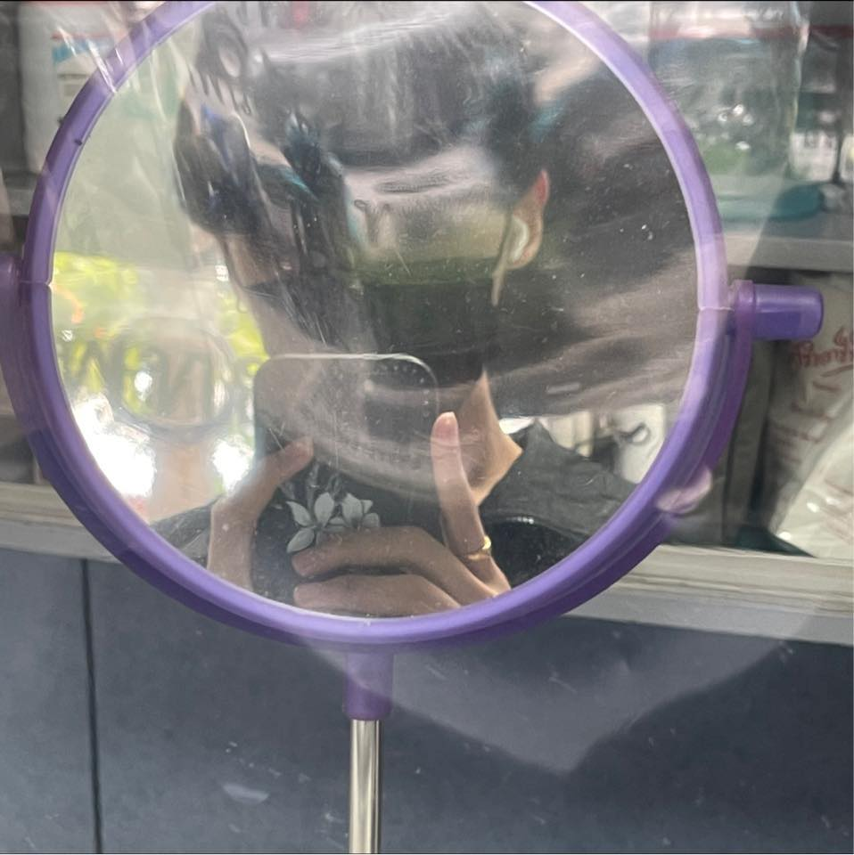

# Project_bot
This project is part of subject Problem Solving in Information Technology (PSIT) 
Faculty of Information Technology, King Mongkut's Institute of Technology Ladkrabang (KMITL).  

<h2 id='author'>Author :notebook_with_decorative_cover:</h2>

|||||
|:---:|:---:|:---:|:---:|
|[Suphitsara](https://github.com/jinnygym)|[Kamon](https://github.com/fewkamon)|[Peravit](https://github.com/PeravitK)|[Wiwat](https://github.com/xviiivin)|
|นางสาวศุภิสรา ชีวนันทพร -61070230-|นายกมล เลิศธนสิน -64070001-|นายพีรวิชญ์ กริชฉกาจ -64070076-|นายวิวรรธน์ เหลียงกอบกิจ -64070232-|
